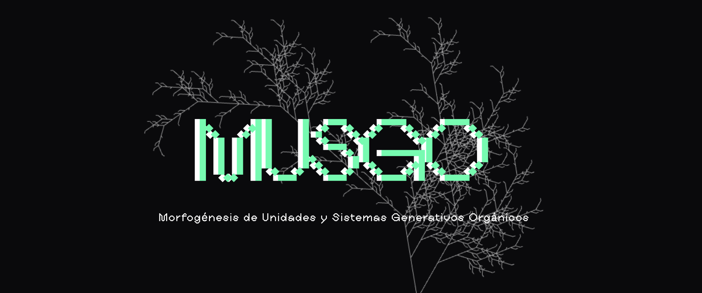
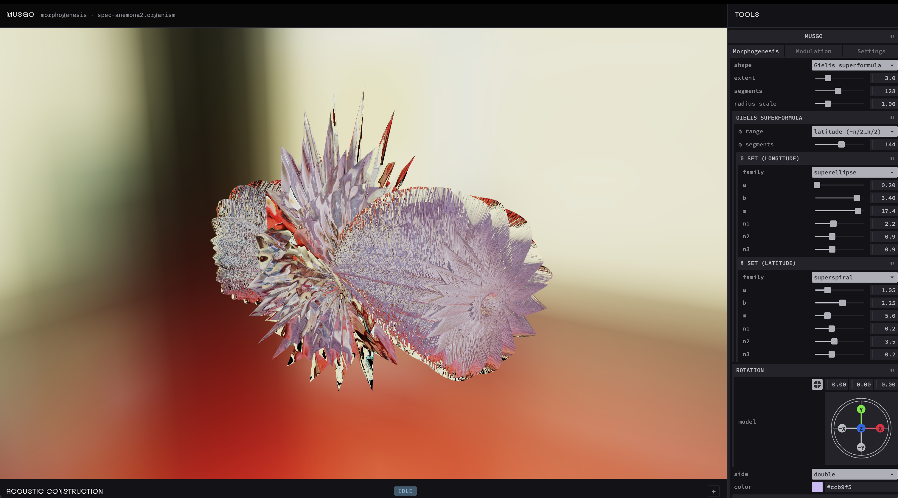
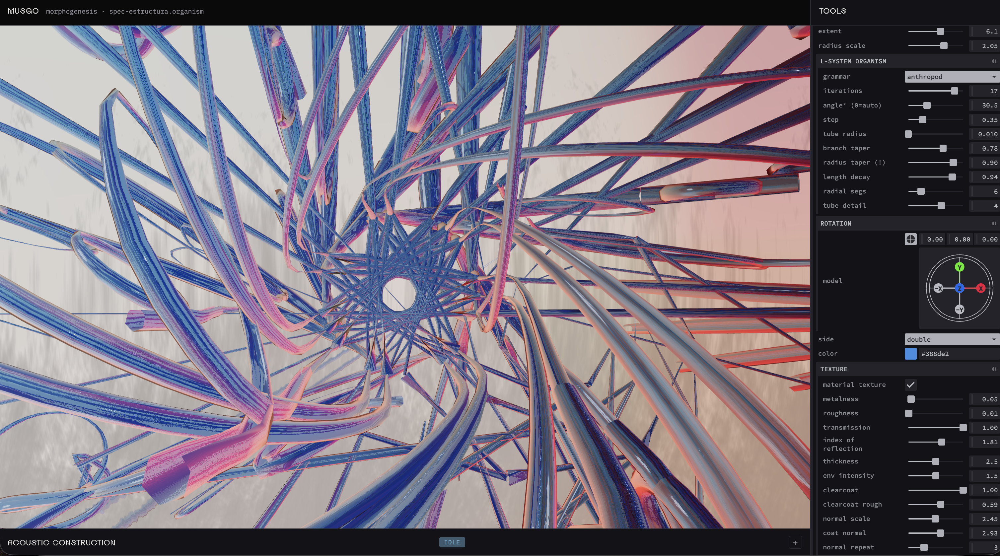
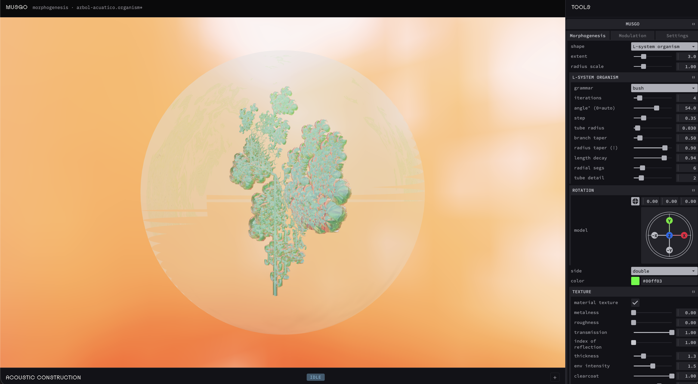
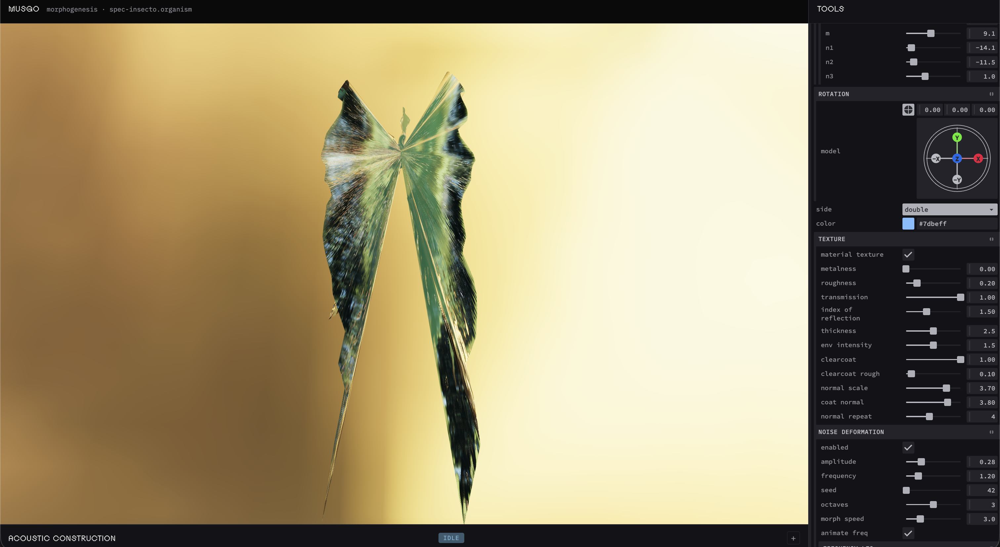

# MUSGO

<p align="center">
  
</p>

Playground for **generative organisms**: procedural morphogenesis, material textures, and saveable specimen state (`.organism` files).

Open the app and click or press **space** to enter the editor, or drop a `.organism` file to load it. Deform with noise, dress with glass/physical materials and HDR/EXR environments, and keep iterating with load / save.

| | |
|:---:|:---:|
|  |  |
|  |  |


## Shape algorithms

Procedural families available in the morphogenesis UI:

- **Torus / torus knot** — classic ring forms (acoustics are designed for these)
- **Minimal surfaces** — Chen–Gackstätter and López–Ros (catenoid or stacked)
- **Gielis superformula** — spherical product of two 2D superformulas (superellipse / superrose / superspiral envelopes)
- **Baschet leaf** — folded-metal leaf outline lofted into a resonator shell
- **L-system organism** — rewrite grammars interpreted by a 3D turtle into tapered tubes (presets: shrimp, anthropod, plant/fern, bush, algae, dragon)
- **DLA (moss / coral)** — diffusion-limited aggregation: random walkers stick into branched clusters; seed, launch, stickiness, neighbor rules, and flow biases shape mossy / coral forms. Element shapes (sphere, box, polyhedra, cone, cylinder) with optional random orientation; noise can deform the whole model or each element independently
- **Loaded GLB** — external models from `cosos/`

## Acoustic model (torus-first)

Chamber detection and the Pd-style patch (`osc~` / `reson~`) were **designed for deformed tori**: bulges along the ring become resonance chambers linked in a serial chain.

On other shapes the analyzer still runs, but results are unreliable — it basically picks random bulges that are not consistent with the model geometry. Treat acoustics as experimental outside the torus; the morphogenesis side is the broader playground.

## Inspiration

- **[Chavín de Huántar](https://ccrma.stanford.edu/groups/chavin/)**: Andean ceremonial galleries as a coupled network of resonance alcoves linked by narrow ducts; [CCRMA’s waveguide model](https://doi.org/10.1121/1.3508227) of the site’s “resonance rooms connected by sound transmission tubes”
- **[Joaquín Orellana](https://www.youtube.com/@JoaquinOrellanaylaUtileriaSono)**: *útiles sonoros*: sculptural instruments derived from the marimba, built to evoke electronic and imagined timbres
- **[Baschet brothers](https://baschet.org/site/)**: *structures sonores*: folded-metal sculptures with conical resonators and diffusers, form and timbre inseparable ([Baschet Sound Structures Association](https://baschet.org/site/index.php/the-baschet-story/))
- **[Johan Gielis](https://en.wikipedia.org/wiki/Superformula)** — superformula as a compact generator of natural and abstract forms
- **[Aristid Lindenmayer](https://en.wikipedia.org/wiki/L-system)** — L-systems / turtle interpretation for plant-like and organism growth
- **[Witten & Sander](https://en.wikipedia.org/wiki/Diffusion-limited_aggregation)** — diffusion-limited aggregation for dendritic / coral growth ([Softology](https://softologyblog.wordpress.com/2016/08/29/diffusion-limited-aggregation-2/), [Arts ’n Science](https://artsnscience.eu/diffusion-limited-aggregation/))

## Run

```bash
npm install
npm start
```

Open [http://localhost:9990](http://localhost:9990)

**With audio** — see [supercollider/README.md](supercollider/README.md):

```bash
npm run bridge   # terminal 1
npm start        # terminal 2
```

Evaluate `supercollider/ResonantTorus.scd` in the SuperCollider IDE, then connect via **Tools → Modulation → External bridge**.

**Shortcuts**
- **Space** (splash) — enter the editor
- Drop `.organism` on splash — open that specimen
- ⌘S / Ctrl+S — save organism
- ⌘K / Ctrl+K — toggle Acoustic Construction bottom panel

**Stack**
- [Three.js](https://threejs.org/) — 3D viewer
- [Tweakpane](https://tweakpane.github.io/docs/) — parameter UI
- [SuperCollider](https://supercollider.github.io/) — exciter-driven chamber network (tube resonators + waveguide links)
- [Web MIDI API](https://developer.mozilla.org/en-US/docs/Web/API/Web_MIDI_API) — live pitch and trigger
- File System Access API — `.organism` load / save / overwrite (⌘S)

## License

MIT
