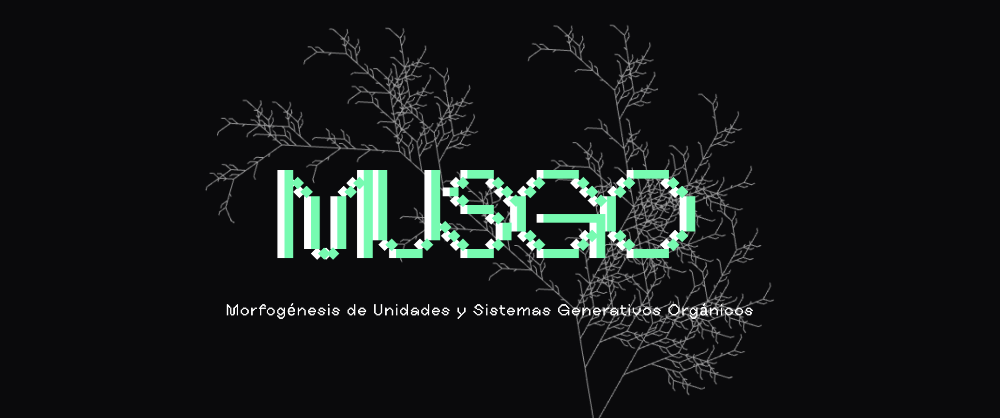
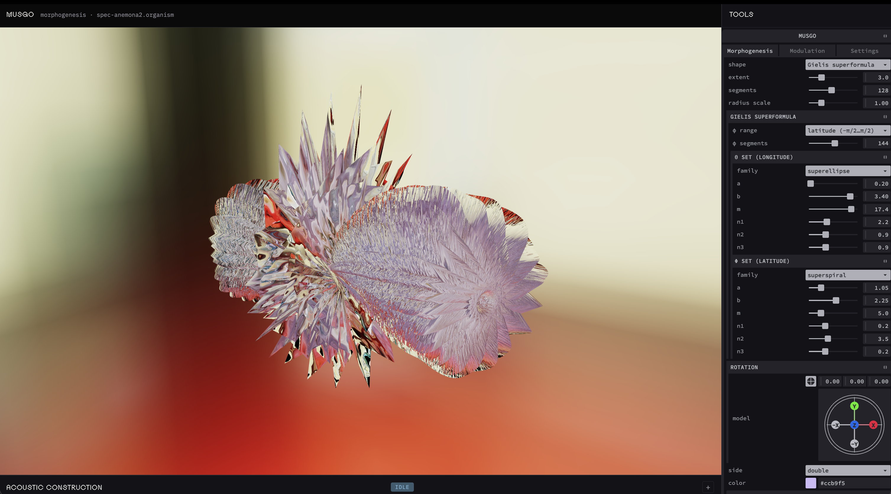
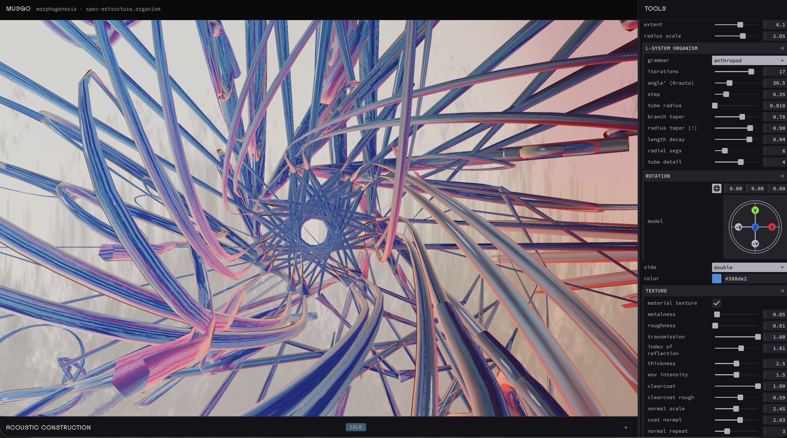
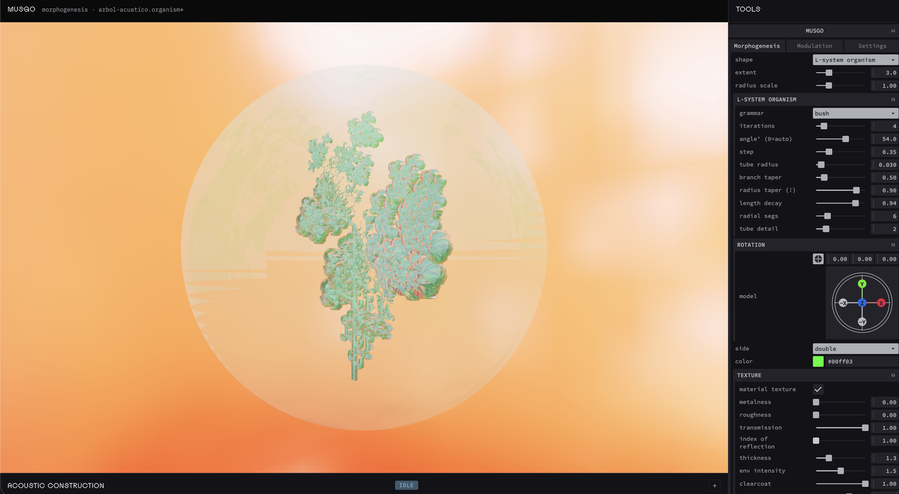
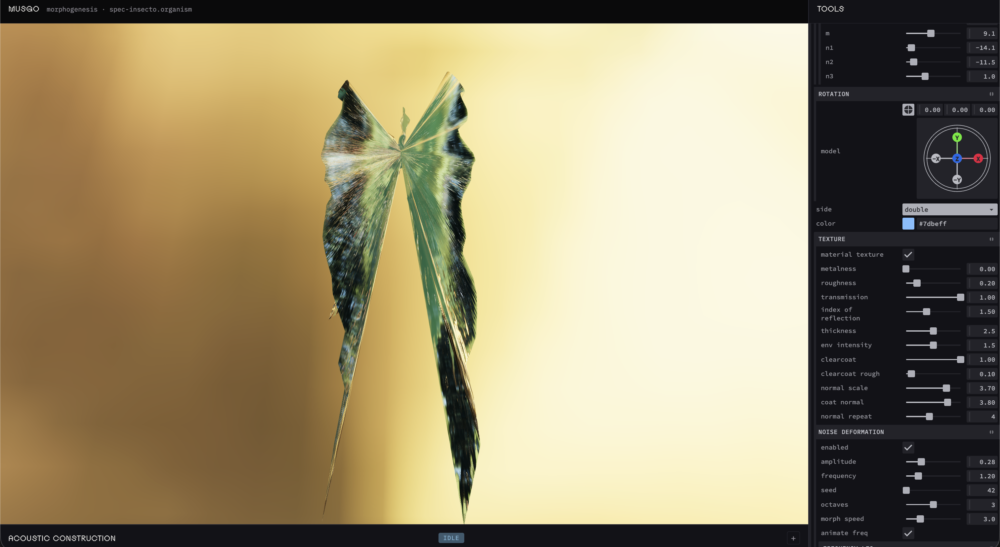

# MUSGO

<p align="center">
  
</p>

Browser playground for **generative 3D organisms**: grow forms from procedural primitives, sculpt the mesh by hand, dress it with materials and HDR environments, and save the whole specimen as a `.organism` file.

Open the app (or press **space**) to enter the editor — or drop a `.organism` to load it.

**Live demo:** [musgo.luminode.studio](http://musgo.luminode.studio/)

| | |
|:---:|:---:|
|  |  |
|  |  |

## Primitives

- **Torus / torus knot** — classic ring forms
- **Minimal surfaces** — Chen–Gackstätter and López–Ros (catenoid or stacked)
- **Gielis superformula** — spherical product of two 2D superformulas
- **Baschet leaf** — folded-metal leaf lofted into a shell
- **L-system** — rewrite grammars as tapered tubes (shrimp, anthropod, plant, bush, algae, dragon, …)
- **DLA (moss / coral)** — diffusion-limited aggregation into branched clusters
- **Imported model** — GLB · OBJ · USDZ · STL (can embed in `.organism`)

## Sculpt

Open the brush button (bottom-right of the viewer) for a toolbar of mesh brushes. Tools follow the [three.js sculpt example](https://threejs.org/examples/webgl_sculpt.html) / Sculptor brush model (MIT), with size, strength, detail, and axis symmetry. Toolbar icons are Blender sculpt brushicons (see [`assets/sculpt-icons/ATTRIBUTION.md`](assets/sculpt-icons/ATTRIBUTION.md)).

| Tool | Role |
|---|---|
| Select | Orbit / pick without deforming |
| Clay | Build toward a plane offset along the surface normal |
| Brush | Soft draw along the normal |
| Inflate | Expand or shrink along normals (Shift = negative) |
| Smooth | Relax toward neighbors |
| Flatten | Pull toward the average brush plane |
| Pinch | Pull vertices toward the brush center |
| Crease | Sharper pinch / crease |
| Drag | Move surface with the pointer |
| Scale | Scale the brushed region |


## Desktop (WIP)

A local offline build for **macOS and Windows** is in progress on [`spike/electrobun-desktop`](https://github.com/rafaelbecks/resonant-torus/tree/spike/electrobun-desktop), using [Electrobun](https://framework.blackboard.sh/electrobun/).

## Run

```bash
npm install
npm start
```

Open [http://localhost:9990](http://localhost:9990)

**Meta Quest VR** — WebXR immersive view; see [docs/vr-meta-quest.md](docs/vr-meta-quest.md).

**Stack**
- [Three.js](https://threejs.org/) — 3D viewer
- [WebXR](https://threejs.org/docs/#VRButton) — Meta Quest VR ([docs](docs/vr-meta-quest.md))
- [Tweakpane](https://tweakpane.github.io/docs/) — parameter UI
- [Web MIDI API](https://developer.mozilla.org/en-US/docs/Web/API/Web_MIDI_API) — live control
- File System Access / File Handling — `.organism` load & save (PWA)
- [three.js Sculptor](https://threejs.org/examples/webgl_sculpt.html) / [sculpt-3D](https://github.com/marmelab/sculpt-3D) — sculpt brush models (MIT)
- Blender sculpt brushicons — toolbar previews (CC0; see [`assets/sculpt-icons/ATTRIBUTION.md`](assets/sculpt-icons/ATTRIBUTION.md))

## License

MIT
